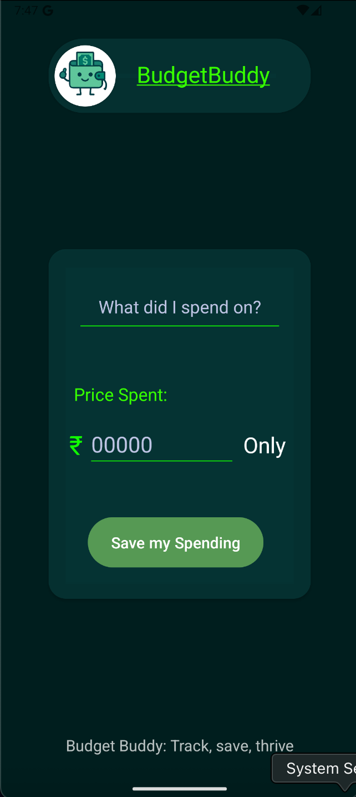
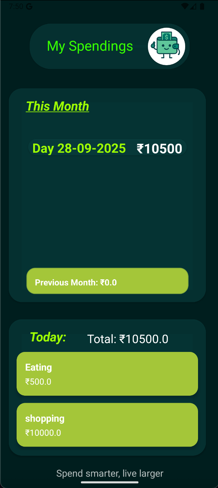

# BudgetBuddy (1st Year REPO)

  
  

**BudgetBuddy** is a simple Android application designed to help users track their daily expenses efficiently.  
Whether it’s food, shopping, or any other expense, BudgetBuddy records everything and provides a clear day-wise summary for better financial management.

---

## Features

- **Add Spending** – Easily save your expense (title + amount)
- **Daily Spendings View** – See your daily spending summury
- **Monthly Summary** – See your total spending summury of this month
- **SQLite Storage** – All data safely stored locally using SQLite database
- **Modern UI** – Clean dark theme with green highlights

---

## 🛠️ Tech Stack

- **Language**: Kotlin
- **IDE**: Android Studio
- **Database**: SQLite
- **UI**: RecyclerView, CardView

---

## Screenshots

### Home Screen

_Add spending easily_  

### Spending Summary

_Daily + Monthly breakdown_  

